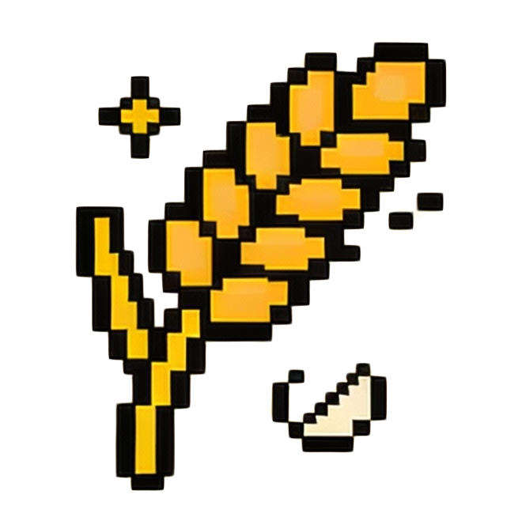
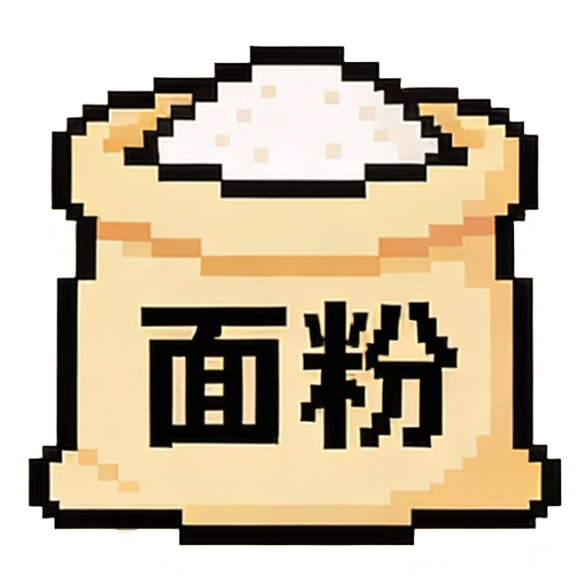
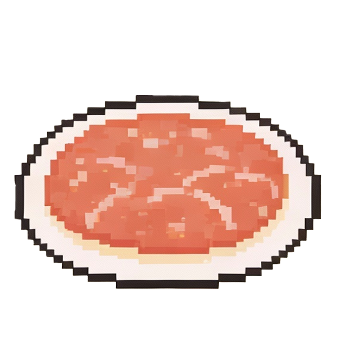
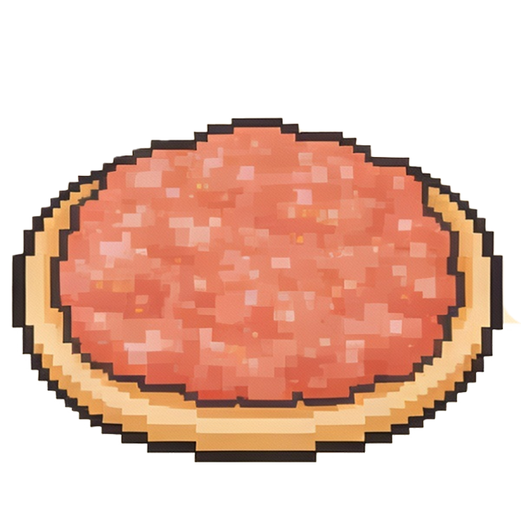
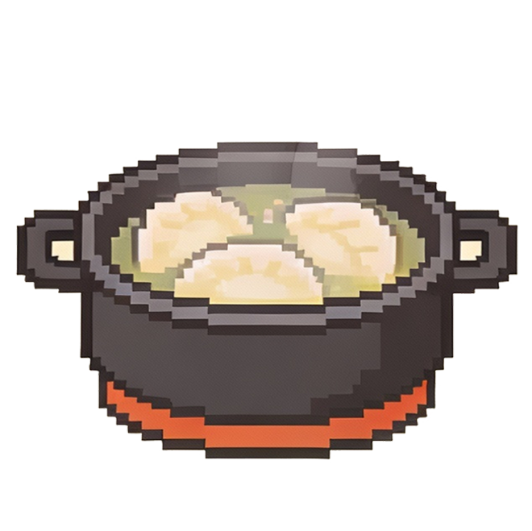
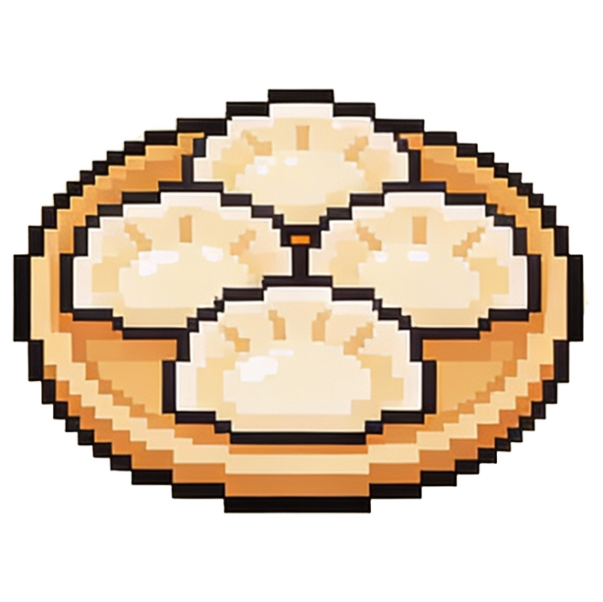
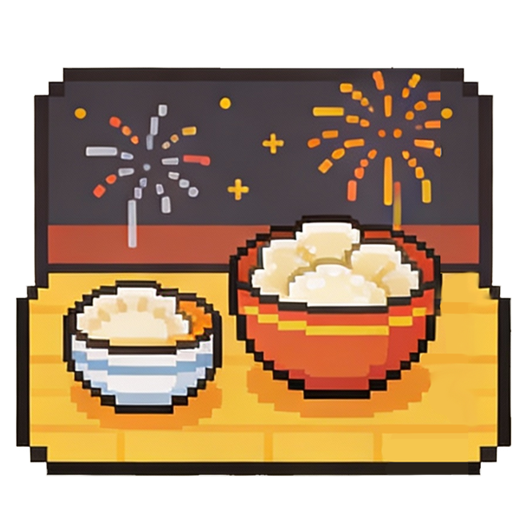

# 包饺子游戏

一款以中国传统包饺子为主题的休闲小游戏，展示了从小麦到年夜饭的完整过程。

## 游戏策划思路

### 核心概念
- **传统文化**：以中国传统美食包饺子为主题，弘扬饮食文化
- **工艺流程**：展示从原料到成品的完整制作过程
- **教育意义**：通过游戏了解传统美食的制作方法

### 设计目标
- 创造一款既有教育意义又有趣味性的游戏
- 展示中国传统美食文化的魅力
- 提供直观的工艺流程展示

## 游戏玩法

### 游戏机制
1. **游戏开始**：玩家进入游戏后，从第一步开始体验包饺子的过程
2. **工艺流程**：玩家按照顺序完成从小麦到年夜饭的各个步骤
3. **视觉反馈**：每个步骤都有相应的图片和动画展示
4. **游戏目标**：完成整个包饺子的工艺流程，最终看到年夜饭的成果

### 操作方式
- 使用鼠标点击进行步骤切换
- 按照游戏界面上的提示进行操作
- 观察每个步骤的变化和细节

## 技术实现

### 技术栈
- **前端技术**：HTML5 + CSS3 + JavaScript
- **图像资源**：精心设计的工艺流程图片
- **动画效果**：步骤切换动画和视觉效果

### 核心功能
- `index.html`：游戏主页面结构
- `style.css`：游戏样式和视觉效果
- `script.js`：游戏逻辑和交互功能

## 运行说明

### 前置条件
- 现代Web浏览器（Chrome、Firefox、Safari等）

### 运行方式
1. 直接在浏览器中打开`index.html`文件
2. 开始体验包饺子的完整工艺流程

## 游戏截图

### 工艺流程

### 游戏界面

### 图标资源

